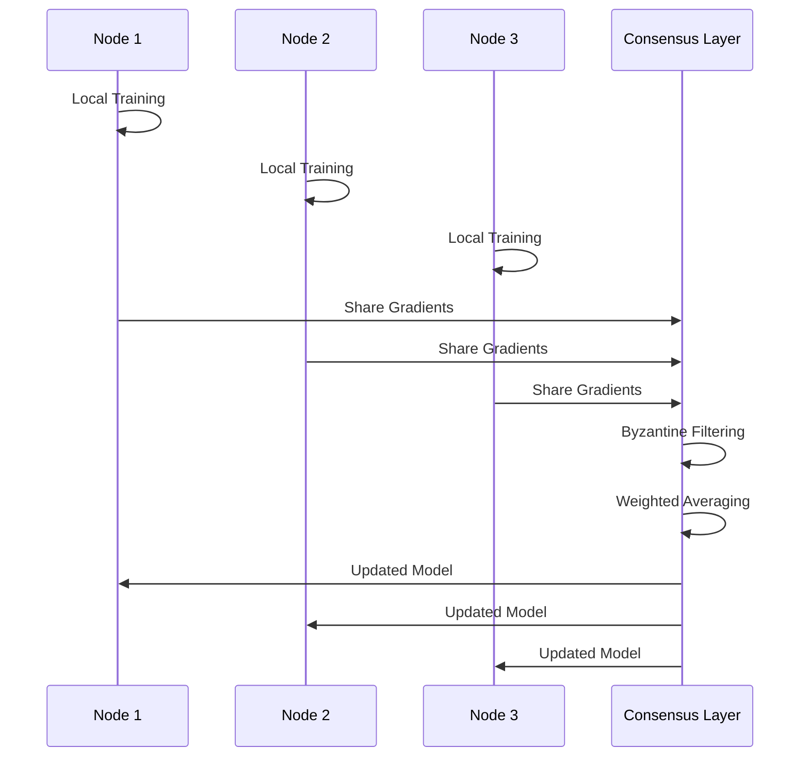

# Distributed Training Architecture 🧠⚡

**By Dineth Nethsara ([@hexlorddev](https://github.com/hexlorddev))**

Deep dive into ncrsh-Swarm's distributed training algorithms and consensus mechanisms.

## 🎯 Core Concepts

### Cooperative Learning Protocol

ncrsh-Swarm implements a novel distributed training protocol that combines:

1. **Federated Averaging**: Nodes train locally and share gradients
2. **Byzantine Fault Tolerance**: Robust against malicious nodes
3. **Adaptive Consensus**: Dynamic leader election and voting
4. **Self-Healing**: Automatic recovery from node failures

### Training Flow



## 🔄 Training Algorithms

### 1. Cooperative SGD

**Basic Algorithm:**
```python
def cooperative_sgd_step(local_gradients, peer_gradients, reputation_scores):
    # Filter Byzantine gradients
    trusted_gradients = byzantine_filter(peer_gradients, reputation_scores)
    
    # Weighted average based on reputation
    weights = [rep / sum(reputation_scores) for rep in reputation_scores]
    averaged_gradients = weighted_average(trusted_gradients, weights)
    
    # Combine with local gradients
    final_gradients = alpha * local_gradients + (1-alpha) * averaged_gradients
    
    return final_gradients
```

**Parameters:**
- `alpha`: Local vs global gradient weight (0.3-0.7)
- `sync_frequency`: How often to sync (every 5-10 batches)
- `min_peers`: Minimum peers required (3+ for Byzantine tolerance)

### 2. Adaptive Momentum

Adjusts momentum based on gradient agreement:

```python
def adaptive_momentum(gradients, agreement_score):
    momentum = base_momentum * agreement_score
    return momentum_update(gradients, momentum)
```

### 3. Reputation-Weighted Learning

Nodes build reputation based on:
- Gradient quality (loss improvement)
- Network reliability (uptime)
- Consensus participation

```python
def update_reputation(node_id, loss_improvement, uptime, consensus_votes):
    reputation = (
        0.5 * loss_improvement +
        0.3 * uptime +
        0.2 * consensus_votes
    )
    return clamp(reputation, 0.1, 1.0)
```

## 🛡️ Byzantine Fault Tolerance

### Gradient Filtering

**Krum Algorithm Implementation:**
```python
def krum_filter(gradients, f_byzantine):
    """Select gradient that's closest to most other gradients"""
    n = len(gradients)
    scores = []
    
    for i, grad_i in enumerate(gradients):
        distances = []
        for j, grad_j in enumerate(gradients):
            if i != j:
                distances.append(torch.norm(grad_i - grad_j))
        
        # Sum of n-f-2 smallest distances
        distances.sort()
        score = sum(distances[:n-f_byzantine-2])
        scores.append(score)
    
    # Return gradient with smallest score
    best_idx = np.argmin(scores)
    return gradients[best_idx]
```

**Coordinate-wise Median:**
```python
def coordinate_median(gradients):
    """Use median for each parameter coordinate"""
    stacked = torch.stack(gradients)
    return torch.median(stacked, dim=0)[0]
```

### Malicious Node Detection

**Statistical Outlier Detection:**
```python
def detect_outliers(gradients, threshold=2.0):
    mean_grad = torch.mean(torch.stack(gradients), dim=0)
    outliers = []
    
    for i, grad in enumerate(gradients):
        distance = torch.norm(grad - mean_grad)
        if distance > threshold * torch.std(torch.stack(gradients)):
            outliers.append(i)
    
    return outliers
```

## 📊 Consensus Mechanisms

### 1. PBFT-inspired Consensus

**Three-Phase Protocol:**

1. **Pre-prepare**: Leader proposes model update
2. **Prepare**: Nodes vote on proposal
3. **Commit**: Nodes commit to agreed update

```python
class ConsensusProtocol:
    def __init__(self, node_id, peers):
        self.node_id = node_id
        self.peers = peers
        self.view = 0
        self.phase = "idle"
    
    async def propose_update(self, model_update):
        # Phase 1: Pre-prepare
        proposal = {
            "view": self.view,
            "sequence": self.get_next_sequence(),
            "update": model_update,
            "hash": hash_model_update(model_update)
        }
        
        await self.broadcast("pre-prepare", proposal)
        self.phase = "prepare"
    
    async def handle_prepare(self, message):
        if self.validate_proposal(message):
            await self.broadcast("prepare", {
                "view": message["view"],
                "sequence": message["sequence"],
                "hash": message["hash"]
            })
    
    async def handle_commit(self, message):
        if self.count_commits(message) >= 2*self.f + 1:
            await self.apply_update(message["update"])
            self.phase = "idle"
```

### 2. Raft-based Leader Election

```python
class RaftLeader:
    def __init__(self):
        self.term = 0
        self.voted_for = None
        self.state = "follower"  # follower, candidate, leader
    
    async def start_election(self):
        self.term += 1
        self.state = "candidate"
        self.voted_for = self.node_id
        
        votes = 1  # Vote for self
        for peer in self.peers:
            response = await peer.request_vote(self.term, self.node_id)
            if response.vote_granted:
                votes += 1
        
        if votes > len(self.peers) // 2:
            self.state = "leader"
            await self.send_heartbeats()
```

## 🔄 Model Synchronization

### Differential Synchronization

Only sync changed parameters:

```python
def differential_sync(old_model, new_model, threshold=1e-6):
    diff = {}
    for name, param in new_model.named_parameters():
        old_param = old_model.state_dict()[name]
        change = torch.norm(param - old_param)
        
        if change > threshold:
            diff[name] = param
    
    return diff
```

### Compression Techniques

**Gradient Compression:**
```python
def compress_gradients(gradients, compression_ratio=0.1):
    # Top-k sparsification
    flat_grad = torch.cat([g.flatten() for g in gradients])
    k = int(len(flat_grad) * compression_ratio)
    
    _, indices = torch.topk(torch.abs(flat_grad), k)
    compressed = torch.zeros_like(flat_grad)
    compressed[indices] = flat_grad[indices]
    
    return compressed, indices
```

## 📈 Performance Optimizations

### 1. Pipelined Training

```python
class PipelinedTrainer:
    def __init__(self, model, pipeline_depth=3):
        self.model = model
        self.pipeline_depth = pipeline_depth
        self.gradient_queue = asyncio.Queue(maxsize=pipeline_depth)
    
    async def train_step(self, batch):
        # Compute gradients asynchronously
        gradients = await self.compute_gradients(batch)
        await self.gradient_queue.put(gradients)
        
        # Apply previous gradients while computing new ones
        if not self.gradient_queue.empty():
            prev_gradients = await self.gradient_queue.get()
            await self.apply_gradients(prev_gradients)
```

### 2. Hierarchical Aggregation

```python
def hierarchical_aggregate(nodes, gradients):
    # Group nodes by network topology
    groups = cluster_by_latency(nodes)
    
    # Local aggregation within groups
    group_gradients = []
    for group in groups:
        local_avg = average_gradients([gradients[node] for node in group])
        group_gradients.append(local_avg)
    
    # Global aggregation between groups
    return average_gradients(group_gradients)
```

### 3. Adaptive Batch Sizing

```python
def adaptive_batch_size(current_loss, target_loss, current_batch_size):
    if current_loss > target_loss * 1.1:
        # Increase batch size for stability
        return min(current_batch_size * 1.2, max_batch_size)
    elif current_loss < target_loss * 0.9:
        # Decrease batch size for faster convergence
        return max(current_batch_size * 0.8, min_batch_size)
    return current_batch_size
```

## 🔧 Configuration

### Training Parameters

```yaml
training:
  algorithm: "cooperative_sgd"
  
  cooperative_sgd:
    alpha: 0.5  # Local vs global weight
    sync_frequency: 5  # Batches between syncs
    byzantine_tolerance: 1  # Max Byzantine nodes
    
  consensus:
    protocol: "pbft"
    timeout: 30.0  # Seconds
    max_retries: 3
    
  performance:
    pipeline_depth: 3
    compression_ratio: 0.1
    adaptive_batching: true
```

## 📊 Monitoring

### Key Metrics

```python
# Consensus metrics
consensus_latency = time_to_reach_consensus()
byzantine_detection_rate = detected_byzantine / total_byzantine
model_divergence = compute_model_divergence()

# Training metrics  
global_loss = compute_global_loss()
convergence_rate = compute_convergence_rate()
communication_overhead = bytes_transmitted / useful_bytes
```

### Performance Profiling

```python
import cProfile
import torch.profiler

# Profile training step
with torch.profiler.profile(
    activities=[torch.profiler.ProfilerActivity.CPU, 
                torch.profiler.ProfilerActivity.CUDA],
    record_shapes=True,
    profile_memory=True
) as prof:
    training_step()

print(prof.key_averages().table(sort_by="cuda_time_total", row_limit=10))
```

## 🚀 Future Enhancements

### 1. Quantum-Resistant Consensus
- Post-quantum cryptographic signatures
- Quantum-safe commitment schemes

### 2. Neuromorphic Optimization
- Spike-based gradient communication
- Event-driven model updates

### 3. Multi-Modal Training
- Support for different model architectures
- Cross-modal knowledge distillation

### 4. Zero-Knowledge Proofs
- Private gradient sharing
- Proof of correct computation

---

**ncrsh-Swarm**: Pushing the boundaries of distributed AI training 🌐🧠